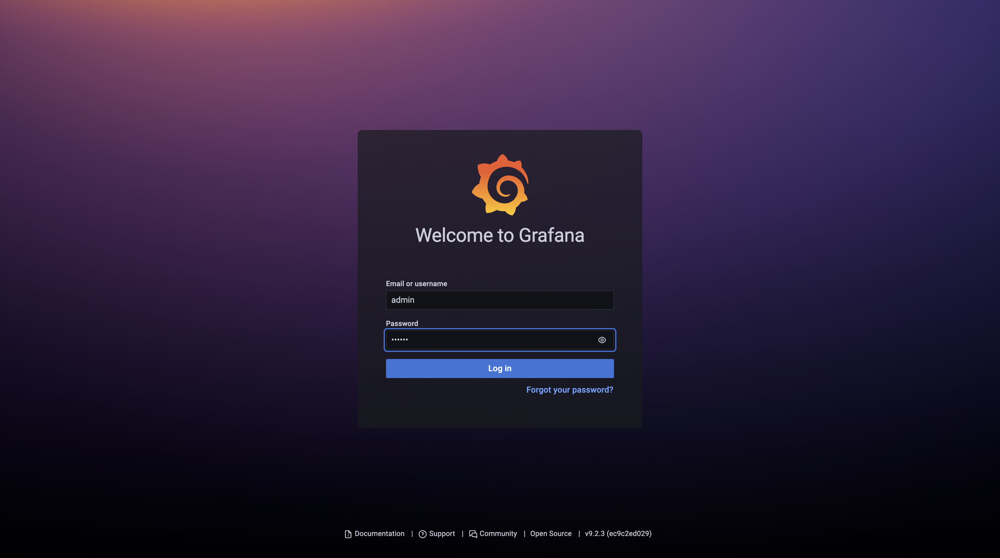
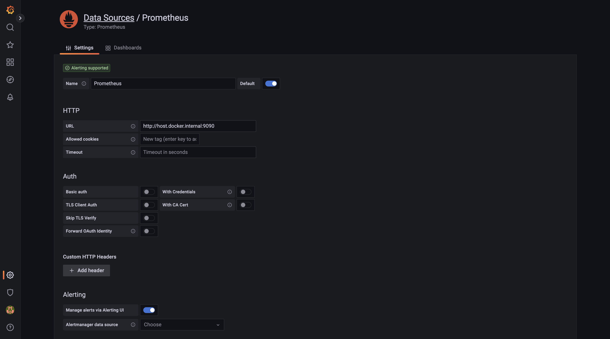
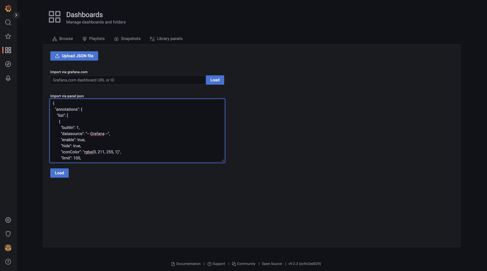
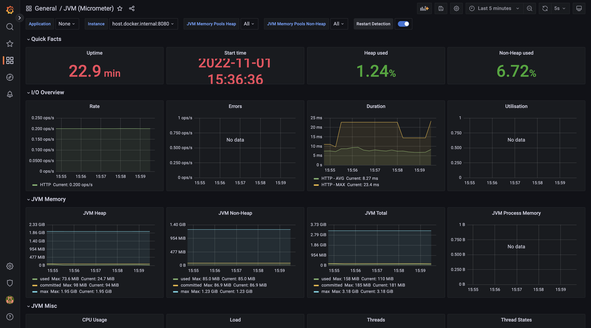
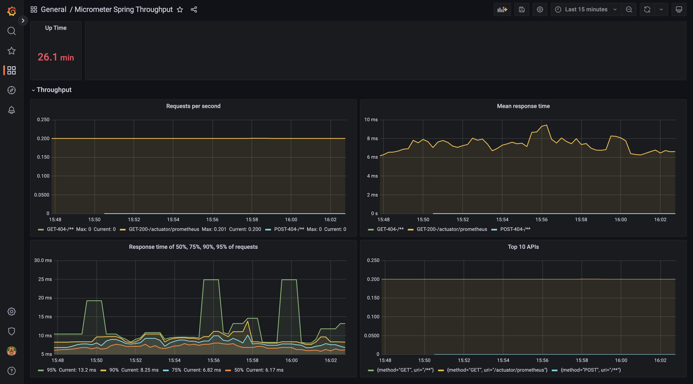

# Исследование AccountService'а 
___

A rock-paper-scissors game backend written on Java.

Tech stack: Java 17, spring-boot, PostgreSQL, Docker, Grafana

## Information about services

### - account-service:

Service for creating an account or changing the balance on an already created one, as well as for obtaining information about the account

The interface contains two requests:

1)Add amount(int accountId, int value)
http://localhost:8080/account

2)Get amount(int accountId)
http://localhost:8080/account/{id}


### - dto-lib

Service that stores shared DTO

### - test client

The service that is needed to create a load on the account-service

The interface contain one request:
Start test (rCount, wCount, idList)
- rCount - количество читателей вызывающих метод getAmount(id) 
- wCount - количество читателей вызывающих метод addAmount(id,value)
- idList - список или доапазон ключей которые будут использоваться для тестирования
  Эти параметры можно задавать через командную строчку или конфигурационный файл.

## How to run 

### Maven + Spring-Boot
Prerequisites: installed docker jdk 17+, maven, git

```
cd <your project dir> 
https://github.com/alexeymoskvinov/ifuture-task
cd rock-paper-scissors
```
### To run with integration tests (started docker is needed)
```
mvn clean install -DskipTests
docker compose up
```

### To run grafana to collect statistics

go to http://localhost:3000/ 

login: admin
password: admin 



Go to: Configuration -> Add data source -> Prometheus

Add http://host.docker.internal:9090 in HTTP URL and click button save & test



Go to Dashboard -> + Import and paste text from data/prometheus/config/jvm-micrometer_rev9.json



Press Load and Import



It`s info about jvm

Import second dashboard from  data/prometheus/config/micrometer-spring-throughput_rev2.json



It`s second dashboard where you can see full information about requests to client service